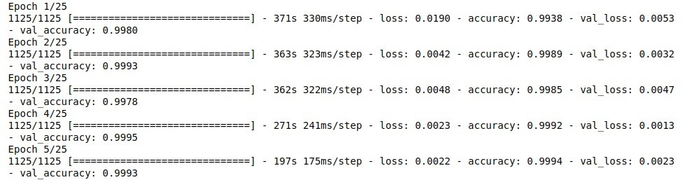

# Dataset

Inicialmente pesquisamos e montamos um dataset personalizado com partes de outros datasets retirados do Kaggle. No momento em que fomos testar o código com o dataset em questão, notamos que nem sempre apresentava o resultado esperado, mesmo que mudássemos os parâmetros de ativação e algumas configurações o resultado negativo persistia.
Após isso decidimos testar outros datasets em que as imagens possuiam um padrão bem definido. Encontramos um dataset de [rostos de pessoas reais](https://www.kaggle.com/jessicali9530/celeba-dataset) e outro de [rostos de personagens de animes](https://www.kaggle.com/soumikrakshit/anime-faces), ambos retirados do mesmo [site](https://www.kaggle.com/).

Mesmo com ambos dataset seguindo a mesma linha em seu conteúdo (rosto), um dataset possuía 203k imagens enquanto o outro apenas 21k. Primeiro igualamos a quantidade de imagens, dividindo 20k imagens para cada training_set e 2k imagens para os test_set. Executamos o código e notamos que demoraria para gerar as epochs especificadas, conforme abaixo:

Insatisfeitos com a demora decidimos reduzir a quantidade de imagens utilizadas no dataset em cerca de 50%. E ainda, reduzimos de 25 para 15 as epochs rodadas.
Assim conseguimos reduzir significativamente o tempo de execução:

Por último ao realizar as predições, obtivemos os resultados esperados para todas os casos de testes contidos na dataset/single_prediction.

